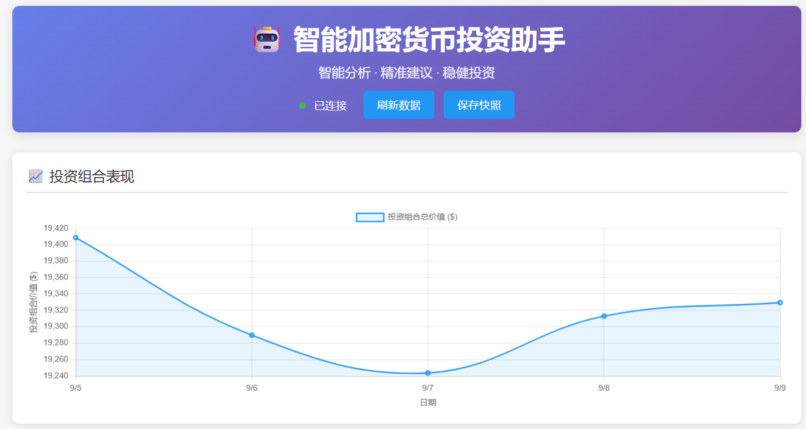
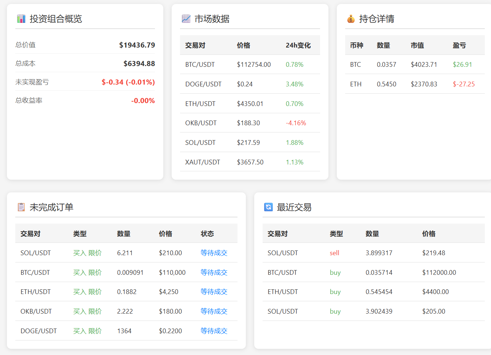
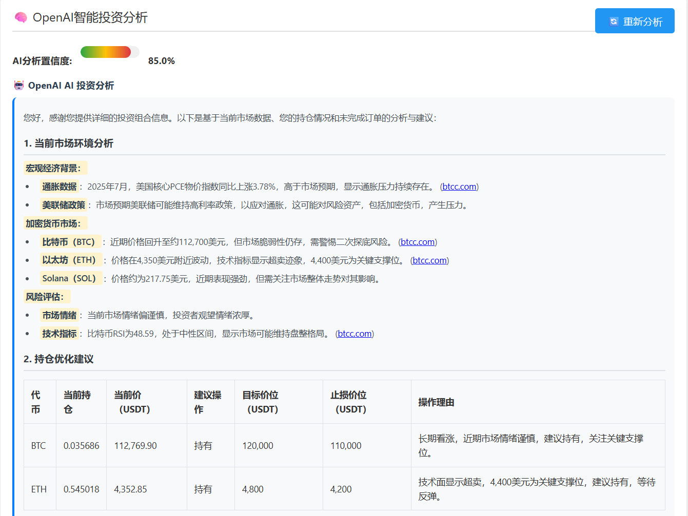
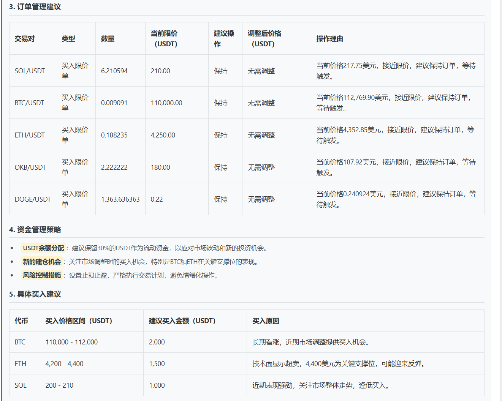

# 🚀 AI加密货币投资助手


🤖 一个基于OpenAI GPT-4o搜索预览模型的智能加密货币投资助手，提供专业的市场分析、投资建议和投资组合管理功能。

## ✨ 核心功能

### 🧠 GPT-4o Search智能分析
- **深度市场分析**: 基于OpenAI GPT-4o搜索预览模型的专业投资分析
- **实时投资建议**: 结合技术指标和最新市场信息的智能建议
- **搜索增强**: 利用搜索功能获取最新市场资讯和分析
- **风险评估**: 智能风险分析和投资组合优化建议

### 📊 投资组合管理
- **实时监控**: 24/7实时跟踪投资组合表现
- **智能计算**: 精确的成本价、盈亏计算
- **历史回溯**: 投资组合历史表现和趋势分析
- **快照管理**: 自动保存投资组合快照

### 📈 技术分析
- **多指标分析**: RSI、MACD、布林带、移动平均线
- **趋势识别**: 自动识别市场趋势和关键价位
- **信号生成**: 基于多重技术指标的交易信号

### 🎯 交易管理
- **实时订单跟踪**: 支持普通订单和算法订单（止盈止损）
- **交易历史分析**: 完整的交易记录和统计
- **自动数据同步**: 与交易所实时同步数据

### 🌐 现代化Web界面
- **响应式设计**: 完美支持桌面和移动设备
- **实时数据**: WebSocket实时数据更新
- **可视化图表**: Chart.js驱动的动态图表
- **暗色主题**: 护眼的深色界面设计

## 🖼️ 界面展示

### 📊 投资组合总览


### 📈 交易所实时数据


### 🤖 AI智能分析




## 🏗️ 技术架构

### 核心技术栈
- **后端**: Python 3.12 + Flask
- **AI引擎**: OpenAI GPT-4o Search Preview
- **数据库**: SQLite + 智能缓存
- **前端**: HTML5 + CSS3 + JavaScript ES6
- **图表**: Chart.js
- **交易所连接**: CCXT库

### 架构特点
- **模块化设计**: 清晰的分层架构
- **异步处理**: 多线程AI分析任务
- **缓存机制**: 智能缓存减少API调用
- **安全防护**: IP白名单和API密钥加密

## 📁 项目结构

```
crypto_invest_with_ai/
├── src/                          # 核心源代码
│   ├── ai/                       # AI分析模块
│   │   ├── analysis/             
│   │   │   ├── smart_analysis_engine.py    # OpenAI GPT-4o分析引擎
│   │   │   ├── technical_analysis.py       # 技术指标分析
│   │   │   └── analysis_task_manager.py    # 任务管理器
│   │   └── recommendation/       
│   │       └── recommendation_engine.py    # 智能推荐引擎
│   ├── data/                     # 数据层
│   │   ├── fetchers/             
│   │   │   ├── market_data_fetcher.py      # 市场数据获取
│   │   │   └── private_data_fetcher.py     # 私有数据获取
│   │   ├── models/               # 数据模型定义
│   │   └── database/             # 数据库管理
│   ├── trading/                  # 交易管理
│   │   └── portfolio/            # 投资组合管理
│   ├── web/                      # Web应用
│   │   ├── app.py               # Flask应用主文件
│   │   ├── templates/           # HTML模板
│   │   └── static/              # 静态资源
│   └── utils/                    # 工具函数
├── config/                       # 配置管理
│   └── config_manager.py        # 配置管理器
│   └── secrets.json             # okx交易所密钥配置和openai密钥配置文件
│   └── config.json              # 关注交易对配置文件
├── data/                         # 数据存储
├── main.py                       # 程序入口
├── requirements.txt              # 依赖包
└── README.md                     # 项目文档
```

## 🚀 快速开始

### 环境要求
- Python 3.12+
- 支持的交易所API（推荐OKX）
- OpenAI API Key (GPT-4o模型访问权限)

### 1. 克隆项目
```bash
git clone https://github.com/2024baibai/crypto_invest_with_ai
cd crypto_invest_with_ai
```

### 2. 安装依赖
```bash
pip install -r requirements.txt
```

### 3. 配置API密钥
config目录下的`secrets.json.example`重命名为`secrets.json`，然后打开编辑，将[okx的api密钥](https://www.okx.com/zh-hans/account/my-api)和[openai的密钥](https://platform.openai.com/settings/organization/api-keys)填入
```json
{
  "exchange": {
    "name": "okx",
    "api_key": "",
    "secret_key": "",
    "passphrase": "",
    "sandbox": true
  },
  "ai": {
    "openai_key": ""
  }
}
```

### 4. 配置关注币种
config目录下的`config.json`
```json
{
  "ai": {
    "model_name": "gpt-4o-search-preview", //模型配置，不建议修改
    "analysis_interval": 3600,
    "confidence_threshold": 0.7,
    "base_url": "https://api.openai.com/v1"
  },
  "symbols": [
    "BTC/USDT",
    "ETH/USDT",
    "SOL/USDT",
    "XAUT/USDT",
    "OKB/USDT",
    "DOGE/USDT"
  ], //关注交易对，如果修改了，需要重启网站
  "data": {
    "history_days": 30,
    "update_interval": 300
  },
  "ip_whitelist": ["127.0.0.1"] //ip白名单，白名单里面的ip才能在网站上保存快照和ai分析
}
```


### 4. 启动应用
```bash
# 启动Web服务器
python main.py 
```

### 5. 访问Web界面
打开浏览器访问: `http://127.0.0.1:6998`

## 常见问题：

### 1. 投资组合表现图表怎么没有数据？
#### 1）请确保已经配置了okx的api密钥
#### 2）明天需要手动在网页上点击**保存快照**，图表才会有数据

#### 2. ai分析怎么没有显示分析结果？
#### 1）请确保已经配置了openai的密钥，且有充足余额
#### 2）请确保本地网络能够连接openai

## ⚠️ 重要免责声明

> **请在使用本项目前仔细阅读以下声明**

### 📈 交易范围限制
- **仅限现货交易**: 本项目专门针对加密货币**现货**交易进行分析，不提供期货、合约或杠杆交易分析
- **不支持衍生品**: 不涉及期权、永续合约等金融衍生品分析

### 🤖 AI分析性质
- **辅助决策工具**: AI分析结果仅供投资参考，不构成投资建议或保证
- **需人工判断**: 所有交易决策需要您结合AI分析结果进行独立判断和手动操作
- **非自动交易**: 本项目不执行任何自动交易操作，所有交易行为由用户自主决定

### 💼 风险提示
- **投资风险**: 加密货币投资存在极高风险，价格波动剧烈，可能导致本金全部损失
- **技术风险**: 软件可能存在技术故障、数据延迟或分析错误的风险
- **市场风险**: 加密货币市场受政策、技术、情绪等多重因素影响，存在不可预测性

### 🛡️ 责任限制
- **无财务责任**: 项目开发者不对任何投资损失、利润损失或其他经济损失承担责任
- **技术免责**: 不保证软件的准确性、可靠性、完整性或适用性
- **使用后果**: 用户使用本项目产生的一切后果由用户自行承担

### 📋 使用条件
- **年龄要求**: 使用者必须年满18岁且具备完全民事行为能力
- **风险承受**: 用户应具备相应的投资经验和风险承受能力
- **合规使用**: 用户需确保在当地法律法规允许的范围内使用本项目

### 💡 投资建议
- **理性投资**: 请根据自身财务状况理性投资，切勿盲目跟随AI建议
- **分散风险**: 建议分散投资，不要将全部资金投入单一品种
- **持续学习**: 建议持续学习投资知识，提高风险识别和管理能力

---

**通过使用本项目，您确认已充分理解并接受上述所有条款。如不同意，请立即停止使用。**